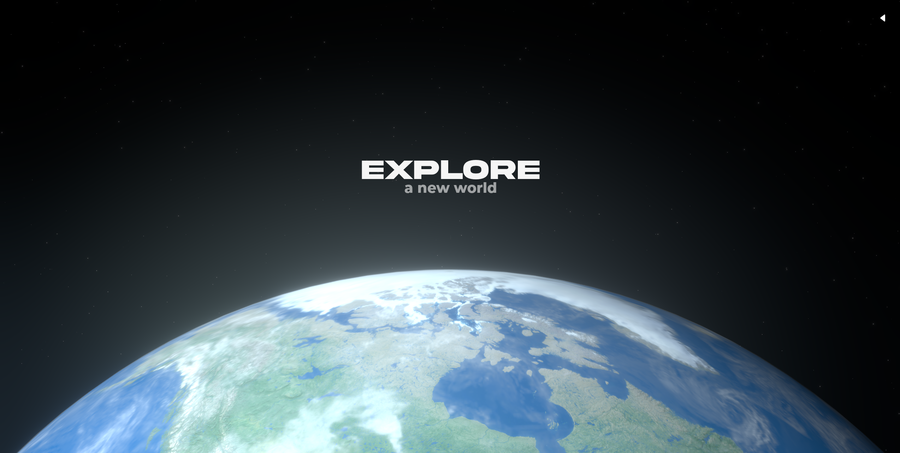

    <h1>Spacescape</h1>
    
    
    
    
    <h4>Spacescape is a browser based multiplayer space survival game</h4>
    
    

## Hello there !
I'm [**@thomas-rooty**](https://github.com/thomas-rooty), and I'm the lead developer of Spacescape. I'm a French student in computer science, and I'm passionate about video games, web development and AI. I'm also a huge fan of space exploration, and I'm always looking for new ways to combine my passions.

Click [here](https://www.youtube.com/watch?v=xRtPwq5lGvc) to find out more about the Spacescape project on YouTube !

## Synopsis

In the year 2300, Earth has reached its breaking point. Decades of environmental neglect, pollution, and wars have left the planet on the brink of collapse. In a desperate bid for survival, humanity turns its eyes to the stars, seeking a new home among the vast expanse of space.

"Spacescape" begins with the player witnessing the final days of Earth. Amidst this chaos, you board a state-of-the-art spaceship, your sights set on a distant, habitable planet. As you enter cryogenic sleep for the long journey ahead, a sense of hopeful anticipation fills the air.

However, destiny has a different plan.

You are jarringly awoken not by the gentle orbit of your new home, but by the blaring alarms and flashing red lights of an emergency. The cryogenic system has failed, and your ship is spiraling out of control, forcing an emergency landing on an uncharted planet.

As you step out into this alien world, you find yourself in a stark, barren landscape. With your spaceship damaged and no signs of life immediately apparent, survival becomes your primary goal. You must explore this mysterious planet, scavenge for resources, and uncover its hidden secrets.

But you are not alone.

In a twist of fate, this planet harbors other humans - like you, they have failed to reach their intended destination. Questions abound: Why have so many ships landed on this particular planet? What mysteries does it hold?

"Spacescape" is a journey of survival, discovery, and the unyielding human spirit. As you repair your ship and uncover the planet's secrets, you might just find the answers to why this cosmic coincidence occurred – and what your true destiny may be.

## Game design document
### 1. Introduction

**Game Title**: Spacescape

**Development Tools**:
* Frontend: Next.js, React Three Fiber
* Physics: Rapier
* State Management: Zustand
* Multiplayer & Server Events: WebSocket.io

**Game Type**: Multiplayer Space Survival Game

### 2. Game Overview

**Concept**: Spacescape is a multiplayer space survival game set in a future where Earth has been ravaged by pollution and war. The player embarks on a journey to find a new home, dealing with unexpected challenges and discoveries.

**Target Audience**: Fans of space exploration and survival games, with an interest in multiplayer experiences and WebGL graphics.

**Unique Selling Points**:
* Trying realistic space physics and environment.
* Deep narrative intertwined with survival mechanics.
* Multiplayer interaction in a WebGL dynamically evolving world.
### 3. Story and Setting

**Plot Summary**: In the year 2300, Earth is dying. The player leaves Earth in a spaceship, entering cryogenic sleep, aiming for a new home planet. However, an emergency awakens the player on an unknown planet filled with surprises, including other stranded humans.

**Setting**: Earth in the year 2300, a futuristic spaceship, and an uncharted planet.

**Narrative Arc**: Discovery, survival, and the mystery of the unknown planet.
### 4. Gameplay Mechanics

**Core Gameplay:**
* Exploration and resource gathering.
* Survival elements (food, health, spaceship repair).
* Interaction with environment and possibly other players.

**Challenges:**
* Hostile environments.
* Limited resources.
* The need to repair the spaceship.

**Multiplayer Elements:**
* Cooperative or competitive survival.
* Shared exploration and resource management.

### 5. Technical Description

**Graphics & Physics:**
* Utilizes React Three Fiber for WebGL graphics 
* Rapier physics engine for realistic space and planetary physics.

**Networking:**
* WebSocket.io for real-time multiplayer interactions and server events.

**State Management:**
* Zustand for efficient state management in multiplayer environments.

### 6. Art Style and Audio

**Visual Style**: Futuristic and realistic, with a focus on space aesthetics.

**Audio**: Immersive sound design capturing the essence of space and the intensity of survival scenarios.

### 7. Development Timeline

**Phase 1** : Core Development (Game engine setup, basic mechanics)

**Phase 2** : Alpha Release (Testing basic gameplay, multiplayer functionality)

**Phase 3** : Content Creation (Story development, level design)

**Phase 4** : Beta Release (Community testing, bug fixes)

**Phase 5** : Final Release (Launch with marketing and continued support)

### 8. Marketing and Monetization Strategy

All open-source !

# Development stage

### Socket.io to uWebSockets.js
I need to switch from Socket.io to uWebSockets.js. Socket.io is a great library, but it's not fast enough for a real-time multiplayer game. uWebSockets.js is much faster than Socket.io. I'm currently working on the switch and I hope to finish it soon !

### Migrated from cannon to rapier
I've moved from cannon to rapier for physics. Rapier is a physics engine written in Rust and compiled to WebAssembly. It's faster and more stable than cannon which was a real pain in the ass to work with !
